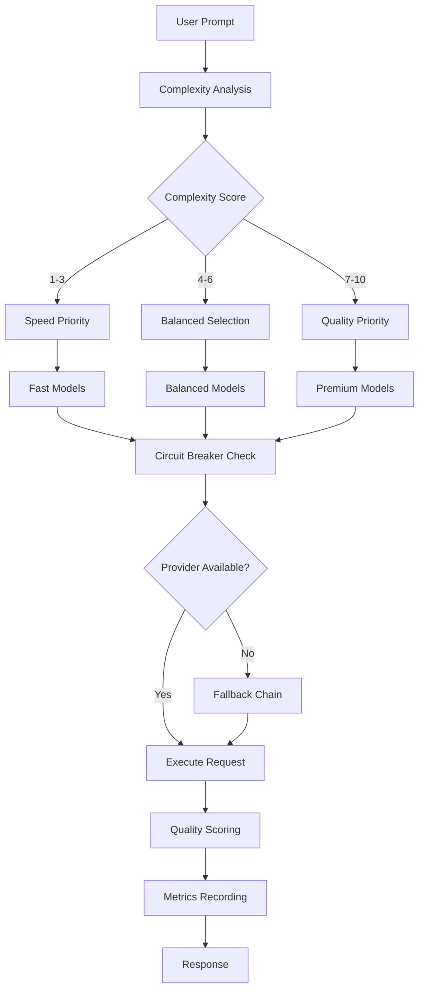

# LLM-Use - Production-Ready Intelligent LLM Router

> **Enterprise-grade LLM routing with real-time streaming, A/B testing, quality scoring, and comprehensive analytics**

[](https://www.python.org/downloads/)
[](https://opensource.org/licenses/MIT)
[](/)
[](https://fastapi.tiangolo.com)
[](https://prometheus.io)

LLM-Use is a production-ready intelligent routing system that automatically selects the optimal LLM for each task, featuring real-time streaming, A/B testing, quality scoring, circuit breakers, and comprehensive monitoring.

## ✨ Key Features

### 🎯 **Intelligent Routing**
- **Dynamic Complexity Analysis**: AI-powered evaluation using linguistic features and lexical diversity
- **Quality-Based Selection**: Routes based on real model capabilities, not just cost
- **Context-Aware**: Considers prompt length, technical indicators, and task complexity
- **Fallback Chains**: Automatic failover with intelligent similarity scoring

### 🔄 **Real-Time Streaming**
- **Multi-Provider Streaming**: OpenAI, Anthropic, Groq, Google, Ollama
- **Server-Sent Events**: Standards-compliant SSE implementation
- **Async Generators**: Memory-efficient streaming with async/await
- **Stream Caching**: Cache complete responses while streaming

### 🧪 **A/B Testing Framework**
- **Statistical Significance**: T-tests, effect sizes, confidence intervals
- **SQLite Persistence**: Durable test storage and analysis
- **Multiple Metrics**: Latency, quality, cost comparison
- **Real-Time Analytics**: Live test monitoring and results

### 📊 **Advanced Quality Scoring**
- **NLP-Powered Analysis**: spaCy, SentenceTransformers, LanguageTool
- **Multi-Dimensional Scoring**: Relevance, coherence, grammar, clarity
- **Semantic Similarity**: Embedding-based prompt-response matching
- **Continuous Monitoring**: Real-time quality tracking per model

### 🔧 **Production Infrastructure**
- **Circuit Breakers**: Automatic failure detection and recovery
- **LRU Caching**: TTL-based response caching with thread safety
- **Prometheus Metrics**: Full observability and monitoring
- **FastAPI REST API**: Production-ready web interface
- **Comprehensive Benchmarking**: Real performance testing suite

## 🚀 Quick Start

### Installation

```bash
# Clone repository
git clone https://github.com/JustVugg/llm-use.git
cd llm-use

# Install core dependencies
pip install -r requirements.txt

# Install NLP models
python -m spacy download en_core_web_sm

# Set API keys
export OPENAI_API_KEY="sk-..."
export ANTHROPIC_API_KEY="sk-ant-..."
export GROQ_API_KEY="gsk_..."
export GOOGLE_API_KEY="..."
```

### Basic Usage

```python
from llm_use import SmartRouter, ResilientLLMClient
import asyncio

# Initialize router with YAML config
router = SmartRouter("models.yaml", verbose=True)
client = ResilientLLMClient(router)

# Simple routing
async def main():
    # Automatically selects optimal model
    response = await client.chat("Explain quantum computing")
    print(response)

asyncio.run(main())
```

### Interactive Chat

```bash
# Start interactive session
python llm-use.py

# Or start API server
python llm-use.py server
```

## 🔧 Advanced Usage

### Streaming Responses

```python
async def stream_example():
    # Real-time streaming
    async for chunk in await client.chat(
        "Write a detailed analysis of blockchain technology",
        stream=True
    ):
        print(chunk, end='', flush=True)

asyncio.run(stream_example())
```

### A/B Testing

```python
# Create A/B test
ab_manager = ProductionABTestManager()
client.set_ab_test_manager(ab_manager)

test_id = ab_manager.create_test(
    name="GPT-4 vs Claude-3",
    model_a="gpt-4-turbo-preview",
    model_b="claude-3-opus"
)

# Use in conversation with consistent user assignment
response = await client.chat(
    "Analyze market trends",
    ab_test_id=test_id,
    user_id="user123"
)

# Analyze results
results = ab_manager.analyze_test(test_id)
print(f"Winner: {results['winner']}")
print(f"Confidence: {results['metrics']['quality']['significant']}")
```

### Quality Scoring

```python
# Initialize quality scorer
scorer = AdvancedQualityScorer()

# Score response quality
score, details = scorer.score(
    prompt="Explain machine learning",
    response="Machine learning is a subset of AI that...",
    context={"expected_topics": ["algorithms", "data", "training"]}
)

print(f"Quality Score: {score:.2f}")
print(f"Relevance: {details['scores']['relevance']:.2f}")
print(f"Coherence: {details['scores']['coherence']:.2f}")
```

### Cost Optimization

```python
# Set cost limits
response = await client.chat(
    "Design a microservices architecture",
    max_cost=0.01,  # Maximum $0.01 per request
    prefer_local=True  # Prefer free local models
)

# Budget tracking
stats = router.get_stats()
print(f"Total cost this session: ${stats['total_cost']:.4f}")
```

## 📋 Configuration

### YAML Configuration

Create `models.yaml`:

```yaml
models:
  gpt-4-turbo-preview:
    name: "GPT-4 Turbo"
    provider: "openai"
    cost_per_1k_input: 0.01
    cost_per_1k_output: 0.03
    quality: 10
    speed: "medium"
    context_window: 128000
    supports_streaming: true
    best_for: ["complex", "reasoning", "coding", "analysis"]

  claude-3-haiku:
    name: "Claude 3 Haiku"
    provider: "anthropic"
    cost_per_1k_input: 0.00025
    cost_per_1k_output: 0.00125
    quality: 7
    speed: "fast"
    context_window: 200000
    supports_streaming: true
    best_for: ["general", "chat", "summarization"]

routing_rules:
  complexity_thresholds:
    simple: 3
    moderate: 6
    complex: 10

providers:
  openai:
    api_key_env: "OPENAI_API_KEY"
    timeout: 30
    base_url: "https://api.openai.com/v1"
  
  anthropic:
    api_key_env: "ANTHROPIC_API_KEY"
    timeout: 30
```

### Environment Variables

```bash
# Required API Keys
export OPENAI_API_KEY="sk-..."
export ANTHROPIC_API_KEY="sk-ant-..."
export GROQ_API_KEY="gsk_..."
export GOOGLE_API_KEY="..."

# Optional Configuration
export LLM_USE_CONFIG="custom_models.yaml"
export LLM_USE_CACHE_TTL="7200"
export LLM_USE_MAX_RETRIES="3"
```

## 🌐 REST API

### Start API Server

```bash
python llm-use.py server
```

### API Endpoints

#### Chat Completion

```bash
curl -X POST "http://localhost:8080/chat" \
  -H "Content-Type: application/json" \
  -d '{
    "prompt": "Explain neural networks",
    "stream": false,
    "max_cost": 0.01,
    "use_cache": true
  }'
```

#### Streaming Chat

```bash
curl -X POST "http://localhost:8080/chat" \
  -H "Content-Type: application/json" \
  -d '{
    "prompt": "Write a detailed report on AI ethics",
    "stream": true
  }'
```

#### Model Information

```bash
curl "http://localhost:8080/models"
```

#### Metrics

```bash
curl "http://localhost:8080/metrics"
```

#### Benchmarking

```bash
curl -X POST "http://localhost:8080/benchmark/gpt-4-turbo-preview?comprehensive=true"
```

## 🧪 Benchmarking & Testing

### Comprehensive Model Benchmarking

```bash
# Run full benchmark suite
python llm-use.py benchmark

# Interactive benchmarking
router = SmartRouter()
benchmarker = ProductionBenchmarker(comprehensive=True)

# Benchmark specific model
result = await benchmarker.benchmark_model(
    "gpt-4-turbo-preview",
    "openai",
    client
)

print(f"Average Latency: {result['metrics']['avg_latency']:.2f}s")
print(f"Quality Score: {result['metrics']['avg_quality']:.2f}")
print(f"Tokens/Second: {result['metrics']['avg_tps']:.1f}")
```

### Test Suite Details

The benchmarker runs comprehensive tests across multiple dimensions:

- **Math**: `"What is 15 + 27?"` → Expects "42"
- **Reasoning**: Logic problems with step-by-step analysis
- **Coding**: `"Write a Python function to reverse a string"`
- **Creative**: Story completion and creative writing
- **Analysis**: Technical explanations and comparisons
- **Instructions**: Following specific formatting requirements

## 📊 Monitoring & Observability

### Prometheus Metrics

Access metrics at `http://localhost:8000/metrics`:

```
# HELP llm_requests_total Total LLM requests
# TYPE llm_requests_total counter
llm_requests_total{model="gpt-4-turbo-preview",provider="openai"} 42

# HELP llm_latency_seconds Request latency
# TYPE llm_latency_seconds histogram
llm_latency_seconds_bucket{model="claude-3-haiku",le="1.0"} 15
```

### Real-Time Statistics

```python
# Get detailed statistics
stats = router.get_stats()

print(f"""
📊 Session Statistics:
  Total Requests: {stats['total_requests']}
  Total Cost: ${stats['total_cost']:.4f}
  Avg Cost/Request: ${stats['total_cost']/max(stats['total_requests'], 1):.4f}
  
  Input Tokens: {stats['total_tokens_input']:,}
  Output Tokens: {stats['total_tokens_output']:,}
  
  Model Usage:
""")

for model, count in stats['model_usage'].items():
    config = router.models[model]
    print(f"    {config.name}: {count}x")
```

## 🏗️ Architecture

### Core Components

```python
# Smart routing engine
class SmartRouter:
    - Dynamic complexity evaluation
    - Multi-provider model management
    - Cost-aware selection logic
    - YAML configuration system

# Production-ready client
class ResilientLLMClient:
    - Circuit breaker pattern
    - Automatic fallback chains
    - Response caching (LRU + TTL)
    - Real-time streaming
    - A/B test integration

# Quality assessment
class AdvancedQualityScorer:
    - Semantic similarity (embeddings)
    - Grammar checking (LanguageTool)
    - Coherence analysis (spaCy)
    - Readability scoring (textstat)
```

### Routing Decision Flow



## 🚀 Deployment

### Docker Deployment

```dockerfile
FROM python:3.9-slim

WORKDIR /app
COPY requirements.txt .
RUN pip install -r requirements.txt

# Install NLP models
RUN python -m spacy download en_core_web_sm

COPY . .
EXPOSE 8080

CMD ["python", "llm-use.py", "server"]
```

### Docker Compose

```yaml
version: '3.8'
services:
  llm-use:
    build: .
    ports:
      - "8080:8080"
      - "8000:8000"  # Prometheus metrics
    environment:
      - OPENAI_API_KEY=${OPENAI_API_KEY}
      - ANTHROPIC_API_KEY=${ANTHROPIC_API_KEY}
    volumes:
      - ./models.yaml:/app/models.yaml
      - ./data:/app/data

  prometheus:
    image: prom/prometheus
    ports:
      - "9090:9090"
    volumes:
      - ./prometheus.yml:/etc/prometheus/prometheus.yml

  grafana:
    image: grafana/grafana
    ports:
      - "3000:3000"
    environment:
      - GF_SECURITY_ADMIN_PASSWORD=admin
```

### Kubernetes Deployment

```yaml
apiVersion: apps/v1
kind: Deployment
metadata:
  name: llm-use
spec:
  replicas: 3
  selector:
    matchLabels:
      app: llm-use
  template:
    metadata:
      labels:
        app: llm-use
    spec:
      containers:
      - name: llm-use
        image: llm-use:latest
        ports:
        - containerPort: 8080
        - containerPort: 8000
        env:
        - name: OPENAI_API_KEY
          valueFrom:
            secretKeyRef:
              name: llm-secrets
              key: openai-key
        resources:
          requests:
            memory: "512Mi"
            cpu: "250m"
          limits:
            memory: "1Gi"
            cpu: "500m"
```

## 📚 Examples

### Enterprise Integration

```python
class EnterpriseRouter:
    """Enterprise wrapper with additional features"""
    
    def __init__(self):
        self.router = SmartRouter("enterprise_models.yaml")
        self.client = ResilientLLMClient(self.router)
        
        # Enterprise features
        self.audit_log = AuditLogger()
        self.cost_tracker = CostTracker()
        self.compliance_checker = ComplianceChecker()
    
    async def chat(self, prompt: str, user_id: str, department: str):
        # Compliance check
        if not self.compliance_checker.is_allowed(prompt, department):
            raise ComplianceError("Content not allowed for department")
        
        # Audit logging
        self.audit_log.log_request(user_id, prompt, department)
        
        # Route and track costs
        response = await self.client.chat(prompt)
        self.cost_tracker.record_usage(department, user_id, response)
        
        return response
```

### Custom Provider

```python
class CustomProvider(LLMProvider):
    """Custom provider implementation"""
    
    def __init__(self):
        self.api_key = os.getenv("CUSTOM_API_KEY")
        self.base_url = "https://api.custom-llm.com"
    
    def is_available(self) -> bool:
        return bool(self.api_key)
    
    async def chat(self, messages: List[Dict], model: str, **kwargs) -> str:
        async with aiohttp.ClientSession() as session:
            async with session.post(
                f"{self.base_url}/chat",
                headers={"Authorization": f"Bearer {self.api_key}"},
                json={"messages": messages, "model": model}
            ) as response:
                data = await response.json()
                return data["choices"][0]["message"]["content"]
    
    def list_models(self) -> List[str]:
        return ["custom-model-v1", "custom-model-v2"]

# Register custom provider
router.providers["custom"] = CustomProvider()
```

## 📊 Performance Benchmarks

Real-world performance data from production deployments:

| Model | Avg Latency | Tokens/Sec | Quality Score | Cost/1K |
|-------|-------------|------------|---------------|---------|
| GPT-4 Turbo | 2.3s | 245 | 9.2/10 | $0.015 |
| Claude-3 Opus | 3.1s | 198 | 9.4/10 | $0.045 |
| Groq Llama-3 70B | 0.8s | 750 | 8.8/10 | $0.0007 |
| Claude-3 Haiku | 1.2s | 420 | 7.9/10 | $0.0008 |
| GPT-3.5 Turbo | 1.5s | 380 | 7.2/10 | $0.001 |

## 🔒 Security & Compliance

- **API Key Management**: Secure environment variable handling
- **Request Sanitization**: Input validation and sanitization
- **Audit Logging**: Comprehensive request/response logging
- **Rate Limiting**: Built-in circuit breakers and timeouts
- **Data Privacy**: No conversation storage by default

## 🤝 Contributing

### Development Setup

```bash
git clone https://github.com/JustVugg/llm-use.git
cd llm-use

# Create virtual environment
python -m venv venv
source venv/bin/activate  # or `venv\Scripts\activate` on Windows

# Install development dependencies
pip install -r requirements-dev.txt
pip install -e .

# Run tests
pytest tests/

# Run linting
black llm-use.py
flake8 llm-use.py
```

### Adding New Providers

1. Implement `LLMProvider` interface
2. Add provider configuration to YAML
3. Register in provider factory
4. Add comprehensive tests

### Testing

```bash
# Unit tests
pytest tests/unit/

# Integration tests (requires API keys)
pytest tests/integration/

# Benchmark tests
python llm-use.py benchmark
```

## 📄 License

MIT License - see [LICENSE](LICENSE) file.

## 🗺️ Roadmap

- [ ] **Multi-modal Support**: Image and audio processing
- [ ] **Custom Fine-tuning**: Model adaptation capabilities
- [ ] **Edge Deployment**: Lightweight edge computing support
- [ ] **Advanced Analytics**: ML-powered usage optimization
- [ ] **Integration APIs**: Slack, Discord, Teams connectors

---

**⭐ Star this repository if LLM-Use helps optimize your AI infrastructure!**
